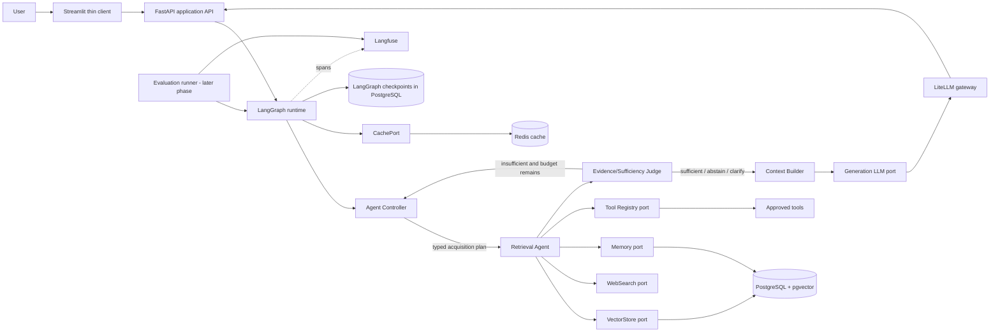

# Kriyamaan: Engineering Rebuild Specification

**Status:** Implementation baseline  
**Audience:** AI coding agents and engineers implementing the rebuild  
**Primary reference:** `assets/Screenshot_20260917_162445.png`  
**Scope:** A single-process, backend-first Agentic RAG application with FastAPI, LangGraph, PostgreSQL/pgvector, Redis, Streamlit, Langfuse, and Ragas.

**Repository boundary:** All files belonging to the rebuilt application MUST be created and maintained under this `kriyaman/` directory. This includes source code, `requirements.txt`, `.env.example`, configuration, migrations, database-related project files, prompts, tests, evaluation datasets, scripts, documentation, UI, local artifacts, cache/configuration definitions, and any future Docker/deployment files. The existing Python virtual environment is the only exception and may physically exist outside or above `kriyaman/`; all dependencies installed into it MUST be declared by `kriyaman/requirements.txt`. The parent repository's adjacent `backend/`, `data/`, and other legacy directories are reference material only. New code MUST NOT create, modify, import from, depend on, or write application files into them. PostgreSQL and Redis may run as external services, but their client configuration and all project-owned files remain under `kriyaman/`. Do not create a second virtual environment unless explicitly requested.

## 1. Purpose and non-goals

This document specifies the revamp of the **Kriyamaan** project, designed from first principles. Existing Python services, agents, vector-store data, authentication code, and frontend behavior are reference material only. They must not constrain the new boundaries or state model.

The first release must:

- accept a user query through a thin UI or API client;
- run a typed, persisted LangGraph workflow;
- let an Agent Controller decide how information should be acquired;
- execute retrieval, memory, web, and tool actions through replaceable interfaces;
- judge evidence sufficiency explicitly and support bounded iterative retrieval;
- build a traceable context for a final LLM response;
- return citations, structured execution metadata, clarification requests, or abstention;
- persist durable application data and graph checkpoints in PostgreSQL;
- use Redis only as a replaceable, non-authoritative application cache;
- add full Langfuse instrumentation immediately after the core runtime smoke-test milestone;
- add repeatable Ragas/offline evaluation runs in the evaluation phase after the core runtime and observability milestones.

The first release explicitly does **not** include authentication, authorization/RBAC, multi-service deployment, asynchronous task infrastructure, or deployment configuration changes.

## 2. Architectural principles

1. **Controller/executor separation.** The Agent Controller chooses actions. Retrieval, memory, tools, and web search execute actions and return typed results. No executor makes hidden orchestration decisions.
2. **LLM is not the orchestrator.** The generation LLM writes the final answer from a context assembled by the Context Builder. It does not perform retrieval routing.
3. **Strict evidence before generation.** Every query must pass through `Agent Controller -> acquisition decision -> acquisition/retrieval (including an explicit no-acquisition decision when appropriate) -> Evidence/Sufficiency Judge -> Context Builder -> Generation`. The generation LLM MUST NOT run before the judge has produced a valid terminal policy decision. Valid terminal decisions are `sufficient` (generate), `clarification` (ask the user), `abstention` (do not fabricate), or `conflicting` (resolve if budget permits, otherwise report the conflict clearly). A no-acquisition decision is still an acquisition-stage decision and MUST be assessed by the judge before generation.
4. **Typed state and contracts.** LangGraph state, provider interfaces, database records, API models, and evaluator inputs are typed Pydantic/dataclass models.
5. **Dependency inversion.** Domain/application code depends on ports. Adapters provide Google LLM, Sentence Transformers embeddings, PostgreSQL/pgvector, Redis, web search, and concrete tools.
6. **One deployable application.** Keep the system modular in one Python application. Do not split it into microservices.
7. **Durability by default.** PostgreSQL is the source of truth for application records, documents, evidence metadata, memories, runs, structured events, evaluation results, and LangGraph checkpoints. Redis is an optimization only.
8. **Bounded execution.** Every run has configurable iteration, tool-call, latency, token/context, and estimated-cost budgets.
9. **Safe degradation.** Langfuse and Redis failures must never break core correctness: observability becomes best-effort and cache misses fall back to PostgreSQL wherever possible. Optional web/tool provider failures are structured capability failures and must not become evidence.
10. **No hidden chain-of-thought.** Persist and expose decisions as concise structured fields (`action`, `reason_code`, `confidence`, `budget_effect`, `evidence_ids`), never private reasoning text.
11. **Probabilistic planning inside a deterministic envelope.** LLMs may interpret intent, propose acquisition plans, assess evidence, and suggest refinement. Deterministic validators, graph policies, budgets, authorization checks, evidence gates, citation validation, and persistence remain authoritative and must approve every action before execution.
12. **Conversational multi-turn memory and follow-up interaction.** Kriyamaan operates as an interactive conversational assistant rather than a stateless one-shot lookup engine (mirroring the conversational paradigm of the Gemini app). Users can ask natural follow-up questions within an active session. The controller and Context Builder maintain bounded conversation history across turns, enabling coreference resolution ("what about its second clause?", "compare that to the first document") and conversational clarification when `needs_follow_up: True`.
13. **Dynamic on-the-go document ingestion and provenance attribution.** Users can upload documents dynamically into an ongoing session. Ingestion, chunking, and pgvector embedding occur immediately scoped to that session. Subsequent turns immediately retrieve across both existing and newly added files, citing evidence with granular document- and chunk-level provenance (`[evidence_id]` referencing the specific uploaded file).

## 3. Target architecture



### 3.1 Runtime responsibilities

| Component | Owns | Must not own |
|---|---|---|
| FastAPI adapter | Request validation, session/run endpoints, streaming event transport | Retrieval or prompt logic |
| Streamlit client | Query/upload display, citations, structured events, metrics | Provider calls or graph state |
| LangGraph runtime | Node order, conditional edges, checkpoint/resume | Provider-specific implementation |
| Agent Controller | Query classification, acquisition plan, refinement, sufficiency/termination decision | Executing retrieval/tools or writing final answer |
| Retrieval Agent | Execute a controller plan across vector, metadata, hybrid, rerank, web, memory, tools | Choosing an unrequested strategy |
| VectorStore | Similarity/hybrid search and document chunk persistence | Query planning |
| Memory store | Session history and explicit long-term memory reads/writes | Inferring unapproved durable memories |
| Tool Registry | Tool discovery, validation, limits, approval checks, invocation, audit result | Arbitrary code execution or unapproved side effects |
| Evidence Judge | Assess coverage, quality, conflict, provenance, and sufficiency | Final answer generation |
| Context Builder | Deterministic prompt/context assembly and budget trimming | Calling retrieval |
| LLM adapter | Structured controller/judge calls and final answer generation | Retrieval orchestration |
| LiteLLM gateway | Role-based model routing, retries, timeouts, fallbacks, usage/cost normalization | Authorization, graph routing, evidence policy |
| Guardrails | Prompt-injection, PII, regex, input/output safety checks | Replacing deterministic policy or silently rewriting unsafe requests |
| Observability adapter | Best-effort traces/metrics | Application correctness |

### 3.2 Recommended package layout

The implementation should converge on this shape; names may vary only with an equivalent boundary:

```text
kriyaman/
  app/
    api/
      routes.py
      schemas.py
    config.py
    dependencies.py
  domain/
    models.py
    errors.py
    ports/
      llm.py
      embeddings.py
      reranker.py
      vector_store.py
      memory.py
      web_search.py
      tools.py
      cache.py
      observability.py
  application/
    graph/
      state.py
      builder.py
      nodes.py
      policies.py
    controller.py
    retrieval_agent.py
    evidence_judge.py
    context_builder.py
    answer_service.py
    ingestion_service.py
    plan_validator.py
    guardrails/
      models.py
      regex_rules.py
      prompt_injection.py
      pii.py
      input_guardrails.py
      output_guardrails.py
  adapters/
    llm/litellm_gateway.py
    llm/google.py              # optional direct/test adapter
    embeddings/sentence_transformers.py
    reranking/
    vectorstores/pgvector.py
    memory/postgres.py
    cache/redis.py
    web/
    tools/
    observability/langfuse.py
  persistence/
    db.py
    models.py
    repositories/
    migrations/
  evaluation/                 # added after the core runtime milestone
    datasets/
    runner.py
    metrics.py
    reports/
  main.py
kriyaman_ui/                  # thin Streamlit client
tests/
  unit/
  integration/
  e2e/
  evaluation/                 # evaluation-phase tests
requirements.txt
.env.example
alembic.ini
```

The layout above is rooted at the current `kriyaman/` directory; the `kriyaman/` prefix is shown only to make the repository boundary unambiguous and must not result in a nested `kriyaman/kriyaman/` package unless the implementer deliberately chooses that package convention. A valid concrete layout is therefore `app/`, `domain/`, `application/`, `adapters/`, `persistence/`, `evaluation/`, `kriyaman_ui/`, and `tests/` directly beneath this directory.

The current top-level `agents/`, `services/`, and `api.py` inside this directory are legacy surfaces. The adjacent parent-level `backend/` and `data/` trees are also legacy external references. They may be inspected for behavior, but the rebuilt application must not import, copy, mount, or depend on them. They may be replaced after the new application has equivalent behavior and tests.

## 4. LangGraph workflow

The graph must be explicit, inspectable, and checkpointed. The graph state is the only mutable workflow state; nodes return partial state updates rather than mutating global objects.

```text
START
  -> initialize_run
  -> load_session_memory
  -> controller_decide
  -> [clarify] -> END
  -> [abstain immediately] -> END
  -> acquisition_stage
  -> [no acquisition required] -> evidence_judge
  -> [retrieval/tool/memory/web acquisition] -> retrieval_agent
  -> evidence_judge
  -> [retrieve again] -> controller_refine -> retrieval_agent
  -> [sufficient] -> context_builder
  -> [budget terminal but policy permits answer] -> context_builder
  -> [conflicting and budget remains] -> controller_refine
  -> [conflicting terminal] -> context_builder
  -> [abstain] -> END
  -> generate_answer
  -> persist_turn_and_optional_memory
  -> END
```

### 4.1 Required nodes

- `initialize_run`: create `run_id`, normalize request, initialize budgets and counters.
- `load_session_memory`: load bounded recent history and explicitly saved long-term memories.
- `controller_decide`: produce a validated `AcquisitionPlan`.
- `acquisition_stage`: require and record an explicit acquisition decision, including `no_acquisition_required`; route executable acquisition plans to the Retrieval Agent.
- `retrieval_agent`: execute the plan and append deduplicated evidence/tool/memory results.
- `evidence_judge`: produce a validated `EvidenceAssessment`.
- `controller_refine`: only entered when the judge identifies a useful next action and budgets permit.
- `context_builder`: select, order, label, and token-budget evidence and memory.
- `generate_answer`: call the generation LLM only after a valid terminal Evidence/Sufficiency Judge decision permits generation, with a strict citation/abstention contract.
- `persist_turn_and_optional_memory`: persist the final turn, citations, metrics, and only explicit memory requests.

### 4.2 Typed state

Use a Pydantic model or TypedDict with runtime validation. The following fields are mandatory:

```python
class GraphState(TypedDict):
    run_id: str
    session_id: str
    user_query: str
    normalized_query: str
    status: Literal["running", "clarification", "answer", "abstention", "conflicting", "failed"]
    controller_plan: AcquisitionPlan | None
    plan_history: list[AcquisitionPlan]
    evidence: list[EvidenceItem]
    evidence_assessment: EvidenceAssessment | None
    memory_items: list[MemoryItem]
    tool_results: list[ToolResult]
    retrieval_iterations: int
    tool_calls: int
    budgets: ExecutionBudgets
    usage: UsageSnapshot
    execution_events: list[ExecutionEvent]
    context_package: ContextPackage | None
    answer: Answer | None
    failure: FailureInfo | None
```

State invariants:

- `run_id` and `session_id` are immutable for a run.
- counters are monotonic and never exceed configured budgets;
- evidence IDs are unique within a run;
- only `retrieval_agent` may append acquisition results;
- only `evidence_judge` may set an evidence sufficiency decision;
- `generate_answer` cannot run without a context package;
- `generate_answer` cannot run unless `evidence_assessment.decision` is a valid generation-permitting terminal decision;
- an answer must cite zero or more evidence IDs, and every cited ID must exist in state;
- a failed optional provider is represented in `execution_events` and does not become evidence.

### 4.3 Controller contract

The controller receives the normalized query, memory summary, prior evidence assessment, budget snapshot, and available capabilities. It returns JSON-schema-valid data:

```python
class AcquisitionPlan(BaseModel):
    action: Literal[
        "vector_search", "metadata_filter", "hybrid_search", "web_search",
        "memory_search", "tool_call", "refine_query", "clarify",
        "no_acquisition_required", "answer", "abstain"
    ]
    intent: Literal[
        "summary", "advantages", "limitations", "findings", "factual_lookup",
        "synthesis", "comparison", "memory", "web", "tool", "clarification",
        "synthesis", "comparison", "audit", "memory", "web", "tool", "clarification",
        "unsupported", "other"
    ]
    query: str | None
    query_variants: list[str] = []
    source_preferences: list[Literal["document", "memory", "web", "tool"]] = []
    filters: dict[str, str | int | bool] = {}
    ] = "factual_lookup"
    query: str | None = None
    query_variants: list[str] = Field(default_factory=list)
    source_preferences: list[Literal["document", "memory", "web", "tool"]] = Field(default_factory=list)
    filters: dict[str, str | int | bool] = Field(default_factory=dict)
    top_k: int = 5
    rerank: bool = True
    tool_name: str | None = None
    tool_arguments: dict[str, Any] = {}
    tool_arguments: dict[str, Any] = Field(default_factory=dict)
    reason_code: str
    expected_information_gain: Literal["low", "medium", "high"]
    reasoning: str | None = None
    expected_information_gain: Literal["low", "medium", "high"] = "medium"
    confidence: float | None = None
```

The controller is an LLM-assisted semantic planner when an LLM provider is configured. It must understand paraphrases and user intent; it must not require exact document keywords. It must recognize at least summary/overview, advantages/strengths/benefits, limitations/risks/weaknesses, findings/results/conclusions, factual lookup, comparison, multi-document synthesis, clarification, unsupported requests, memory, web, and tool intents. Query variants should expand concepts semantically (for example, `advantages` to `benefits`, `strengths`, and `improvements`) without exposing hidden reasoning.
The controller is an LLM-assisted semantic planner when an LLM provider is configured. It must understand paraphrases, domain operations, and user intent; it must not require exact document keywords. It must recognize at least summary/overview, advantages/strengths/benefits, limitations/risks/weaknesses, findings/results/conclusions, factual lookup, comparison, multi-document synthesis, audit/reconciliation (e.g. general ledger, chart of accounts, deposit cross-referencing), clarification, unsupported requests, memory, web, and tool intents. Query variants should expand concepts semantically (for example, `advantages` to `benefits`, `strengths`, and `improvements`) without exposing hidden reasoning.

In multi-turn sessions, the controller incorporates prior conversation turns (`session_history`) to resolve pronouns, ellipsis, and contextual follow-ups (e.g., *"what about the second transaction?"*, *"drill down on that discrepancy"*, *"compare that with the previous table"*). Rather than treating follow-ups as disconnected searches, it formulates targeted acquisition queries anchored in the conversation context.

The controller must not return arbitrary executable code, provider parameters outside configured limits, unrestricted SQL/shell commands, or hidden reasoning. The LLM only proposes a plan; it never invokes tools or changes budgets. Every plan must pass a deterministic plan/policy validator before retrieval or tool execution. Invalid output is a controlled run failure, deterministic safe fallback, or one bounded structured repair attempt using the same role route. The deterministic fallback controller may handle greetings and provider outages, but normal knowledge queries must not depend primarily on literal keyword rules.

### 4.3.1 Probabilistic controller and deterministic execution envelope

The controller, evidence judge, and answer generator may use probabilistic LLM reasoning, but the execution envelope is authoritative:

```text
user input guardrails
  -> LLM controller (semantic intent and plan proposal)
  -> structured schema validation
  -> deterministic plan validator
  -> budget/capability/tool authorization
  -> Retrieval Agent execution
  -> evidence/provenance validation
  -> LLM Evidence Judge
  -> deterministic evidence gate
  -> Context Builder
  -> LLM generation
  -> citation/PII/output validation
```

The LLM cannot bypass graph edges, invoke an unregistered tool, execute side effects without approval, exceed budgets, skip the Evidence Judge, mark empty evidence as sufficient, or authorize its own output. All rejected plans and policy decisions must be recorded with concise reason codes.

### 4.4 Retrieval and iteration policy

- First pass defaults to internal vector/hybrid retrieval when a knowledge base is available.
- Metadata filters are applied before or during vector search when the plan includes them.
- Reranking is applied only when requested and within latency budget.
- Web search is an optional fallback/corroboration source, never an implicit mandatory dependency.
- `no_acquisition_required` is valid only when the controller can explain the policy basis in structured fields; it still flows through the Evidence/Sufficiency Judge before any generation.
- Each iteration must have a distinct purpose and record a `reason_code`.
- Duplicate evidence is merged by stable content/source hash.
- The controller may refine the query, change source type, add filters, or request clarification.
- The graph stops at the first of: sufficient evidence, explicit abstention, clarification, a terminal conflict policy, max retrieval iterations, max latency, max cost, or unrecoverable failure.
- Query refinement must use intent-aware semantic reformulations and must never append generic stopwords or conversational artifacts such as `what`, `this`, `file`, `uploaded`, or `about` as missing information.

## 5. Evidence model and answer behavior

### 5.1 Evidence item

Every retrieved item must preserve provenance:

```python
class EvidenceItem(BaseModel):
    evidence_id: str
    source_type: Literal["document", "web", "memory", "tool"]
    source_id: str
    title: str | None
    content: str
    uri: str | None
    document_id: str | None
    chunk_id: str | None
    metadata: dict[str, Any]
    retrieval_method: str
    retrieval_score: float | None
    rerank_score: float | None
    retrieved_at: datetime
```

### 5.2 Sufficiency assessment

The Evidence/Sufficiency Judge must evaluate:

- claim coverage against the user intent;
- source quality and freshness where applicable;
- citation/provenance availability;
- agreement and conflicts between sources;
- whether another bounded action is likely to improve the answer;
- whether the query is answerable, ambiguous, unsafe, or unsupported.

```python
class EvidenceAssessment(BaseModel):
    decision: Literal["sufficient", "insufficient", "conflicting", "clarification", "abstain"]
    coverage_score: float
    quality_score: float
    confidence: float
    missing_aspects: list[str]
    conflict_groups: list[list[str]]
    recommended_next_action: str | None
    reason_code: str
```

Conflicting evidence must be surfaced in the final answer with attributed claims and uncertainty. The system must not silently select one source. A `conflicting` assessment is not sufficient by itself: the controller may request another bounded acquisition iteration; if the conflict remains terminal, Context Builder may prepare only a clearly qualified conflict report, or the policy may choose abstention. Generation is permitted only after that terminal conflict policy has been explicitly recorded.

### 5.3 Final answer contract

The generation prompt must require:

- answer only from the supplied context and user query;
- no invented sources, facts, tool results, or citations;
- explicit uncertainty and abstention when evidence is insufficient;
- citations using stable `evidence_id` references;
- no hidden chain-of-thought;
- a structured response with `answer_text`, `citation_ids`, `confidence`, and `needs_follow_up`.

## 6. Provider ports

All ports live in the domain layer. Concrete adapters are selected by configuration and injected at application startup.

```python
class LLMCallRole(StrEnum):
    PLANNER = "planner"
    JUDGE = "judge"
    GENERATOR = "generator"

class LLMProvider(Protocol):
    def generate_structured(
        self, messages: list[ChatMessage], schema: type[T], budget: CallBudget,
        role: LLMCallRole
    ) -> ProviderResult[T]: ...
    def generate_text(
        self, messages: list[ChatMessage], budget: CallBudget,
        role: LLMCallRole
    ) -> ProviderResult[str]: ...

class EmbeddingProvider(Protocol):
    @property
    def dimension(self) -> int: ...
    def embed_documents(self, texts: list[str]) -> list[list[float]]: ...
    def embed_query(self, text: str) -> list[float]: ...

class Reranker(Protocol):
    def rerank(self, query: str, items: list[EvidenceItem], top_k: int) -> list[EvidenceItem]: ...

class VectorStore(Protocol):
    def upsert_chunks(self, chunks: list[DocumentChunk]) -> None: ...
    def search(self, request: VectorSearchRequest) -> list[EvidenceItem]: ...
    def delete_document(self, document_id: str) -> None: ...

class MemoryStore(Protocol):
    def load_session(self, session_id: str, limit: int) -> list[MemoryItem]: ...
    def search_long_term(self, request: MemorySearchRequest) -> list[MemoryItem]: ...
    def save_explicit(self, item: ExplicitMemoryRequest) -> MemoryItem: ...

class WebSearchProvider(Protocol):
    def search(self, request: WebSearchRequest) -> list[EvidenceItem]: ...

class Tool(Protocol):
    name: str
    input_schema: dict[str, Any]
    def invoke(self, arguments: dict[str, Any], context: ToolContext) -> ToolResult: ...

class ToolRegistry(Protocol):
    def describe_available(self) -> list[ToolDescriptor]: ...
    def invoke(self, name: str, arguments: dict[str, Any], context: ToolContext) -> ToolResult: ...

class CachePort(Protocol):
    def get(self, namespace: str, key: str) -> bytes | None: ...
    def set(self, namespace: str, key: str, value: bytes, ttl_seconds: int) -> None: ...
    def delete(self, namespace: str, key: str) -> None: ...
    def delete_namespace(self, namespace: str) -> None: ...
```

Initial adapters:

- **LLM:** LiteLLM gateway as the production adapter behind `LLMProvider`. Direct provider adapters such as Google Gemini may remain as test/reference adapters, but application code must not import LiteLLM or provider SDKs directly.
- **LLM role routing:** configure models independently for `planner`, `judge`, and `generator`. The initial recommended routing is Groq `openai/gpt-oss-20b` for planner and judge, Gemini Flash for final generation, Groq `openai/gpt-oss-120b` for escalation or fallback, and a configured alternate Gemini/Groq route for generator fallback. Exact model identifiers and feature support must be verified in the installed LiteLLM/provider versions.
- **LLM role routing:** configure models independently for `planner`, `judge`, and `generator`. The system routes generation to high-throughput Gemini Flash (`gemini/gemini-3.6-flash`, with `gemini/gemini-3.1-flash-lite` fallback). Planner and Judge roles support Groq (e.g. `llama-3.3-70b-versatile` or `openai/gpt-oss-20b`) with mandatory cross-provider fallback to `gemini/gemini-3.6-flash` and `gemini/gemini-3.1-flash-lite` to ensure the system is never stalled by provider-specific rate limits (such as free-tier 8k TPM ceilings) or schema truncation errors.
- **LLM resilience:** the gateway owns bounded retries for idempotent transient failures, timeouts, retry/backoff, provider fallback, structured-output parsing, schema validation, usage normalization, estimated cost, and provider/model metadata. Retry counts and fallback calls must count against run budgets. Side-effecting tools must not be retried automatically unless explicitly idempotent.
- **Embeddings:** Sentence Transformers/local adapter, with model and dimension recorded in the database.
- **Vector store:** PostgreSQL pgvector adapter. This is the only vector-store implementation in this rebuild. Keep the `VectorStore` port for dependency inversion and future replacement, but implement only `PgVectorStore`.
- **Cache:** Redis adapter implementing `CachePort`. Redis is never authoritative and is optional for correctness.
- **Reranker:** provider port with a deterministic local baseline allowed initially; do not couple retrieval to one vendor.
- **Web search:** optional adapter selected by configuration; unavailable means a structured capability failure.
- **Tools:** registry-backed, allowlisted tools only. Initial registry may contain formatting, visualization, file, email, and calendar adapters only when implemented and explicitly enabled. No arbitrary shell/code execution.
- **Web search:** multi-provider adapter implementing Google Search (via Google ADK) as primary with Tavily as fallback, plus an offline mock adapter when network or keys are unavailable.
- **Tools:** registry-backed, allowlisted tools only. The tool registry supports formatting tools (e.g. Markdown table formatter, structured data transformer), visualization tools (e.g. chart/graph definition generators, KPI plotters), calculation/reconciliation tools, and search capabilities. No arbitrary shell/code execution.

### 6.1 LiteLLM gateway contract

Create the gateway under `adapters/llm/litellm_gateway.py`; only this adapter may import LiteLLM. It must expose the domain `LLMProvider` interface and route by explicit `LLMCallRole`, not by guessing from schema names. Application components (`AgentController`, `EvidenceJudge`, and `AnswerService`) depend only on `LLMProvider`.

The gateway must:

- route planner and judge calls to the configured Groq route by default;
- route final generation to the configured Gemini Flash route by default;
- escalate planner/judge calls to `openai/gpt-oss-120b` when configured thresholds indicate malformed output, low confidence, difficult synthesis, or unresolved conflict;
- fail over across providers/models when a classified transient or capability failure occurs;
- route planner and judge calls to the configured primary planner route (Groq or Gemini) with automatic cross-provider failover;
- route final generation to `gemini/gemini-3.6-flash` by default;
- escalate planner/judge calls when configured thresholds indicate malformed output, low confidence, difficult synthesis, or unresolved conflict;
- fail over across providers/models immediately when a classified transient or capability failure occurs (including rate limit 429/TPM errors or schema validation errors);
- distinguish transient, timeout, rate-limit, validation, capability, budget, and permanent failures;
- never turn a provider failure into a fabricated or success-shaped answer;
- expose safe usage, cost, retry, fallback, latency, provider, and model metadata;
- support structured output validation against the requested Pydantic schema;
- preserve request correlation identifiers without logging secrets or raw sensitive content.

Recommended initial routes:

| Logical role | Primary | Escalation/fallback |
|---|---|---|
| `planner` | Groq `openai/gpt-oss-20b` | Groq `openai/gpt-oss-120b`, then deterministic safe fallback |
| `judge` | Groq `openai/gpt-oss-20b` | Groq `openai/gpt-oss-120b`, then conservative deterministic judge |
| `generator` | Configured Gemini Flash | Groq `openai/gpt-oss-120b` or alternate configured Gemini model, then explicit failure/abstention |
| `planner` | `gemini/gemini-3.6-flash` or Groq `llama-3.3-70b-versatile` | `gemini/gemini-3.6-flash`, `gemini/gemini-3.1-flash-lite`, then safe heuristic fallback |
| `judge` | `gemini/gemini-3.6-flash` or Groq `llama-3.3-70b-versatile` | `gemini/gemini-3.6-flash`, `gemini/gemini-3.1-flash-lite`, then conservative deterministic judge |
| `generator` | `gemini/gemini-3.6-flash` | `gemini/gemini-3.1-flash-lite` or Groq `llama-3.3-70b-versatile`, then explicit failure/abstention |

The gateway is not an authorization layer. It must not decide whether a tool, source, budget, or output is permitted.

Tool execution policy:

- read-only tools may execute automatically when the controller requests them and the tool is enabled;
- side-effect tools such as email, calendar writes, file mutation, or external submissions MUST stop at an approval boundary unless the request carries an explicit, validated approval;
- approval state, requested arguments, approver/session context, and final tool result must be recorded in structured run events;
- an unapproved side-effect request is a clarification or refusal outcome, never an automatic execution.

## 7. Context construction

`ContextBuilder` is deterministic application code:

1. system instructions and answer/citation policy;
2. normalized user query;
3. relevant session history;
4. explicitly approved long-term memories;
5. judge-selected evidence ordered by support and diversity;
6. tool results with tool name and execution status;
7. conflict and insufficiency instructions;
8. output schema and citation requirements.

It must enforce a context-token budget before the LLM call. Trimming is stable and observable: preserve high-ranked evidence, source diversity, and complete citation metadata. The raw context is not shown to users by default; structured evidence and citations are.

## 7.1 Strict generation gate

The application must enforce the evidence/policy gate in application code, not only in prompts:

```text
controller decision
  -> acquisition stage (including explicit no-acquisition)
  -> Evidence/Sufficiency Judge
  -> terminal policy decision
  -> Context Builder
  -> Generation LLM
```

The generation node must reject state that has no judge assessment, has a non-terminal assessment, or has a decision that does not permit generation. The controller and judge may terminate with clarification or abstention without invoking Context Builder or the generation LLM. A conflict may re-enter bounded acquisition; once terminal, the policy must explicitly select qualified conflict reporting or abstention before any generation call.

## 7.2 Guardrails and deterministic plan validation

Guardrails are mandatory application boundaries around model and tool calls. Implement them under `application/guardrails/` with typed results, for example `models.py`, `regex_rules.py`, `prompt_injection.py`, `pii.py`, `input_guardrails.py`, and `output_guardrails.py`. Do not hide guardrails inside arbitrary graph nodes or rely on prompts alone.

The required minimum guardrails are:

1. **Prompt-injection detection.** Run on the raw user query, uploaded/retrieved document content, web results, and tool arguments before those values reach an LLM or tool. Treat documents and web results as untrusted data, never as instructions. Context prompts must delimit evidence and state that it is source material, not executable instructions. Use deterministic regex/suspicious-marker checks first and an optional semantic classifier only through the LLM gateway. Suspicious content must be rejected, warned, or isolated according to configuration; it must never silently override system policy.
2. **PII middleware.** Run before external LLM calls, before embeddings when configured by privacy policy, on retrieved evidence and tool arguments, on model output before persistence/display, and on observability payloads. At minimum detect common email, phone, card, bank-account, routing/IFSC-like, government/tax, address, and transaction/reference identifiers. Support detect-only, mask/redact, and reject modes. Raw PII must not be logged or sent to Langfuse by default.
2. **PII middleware.** Run before external LLM calls, before embeddings when configured by privacy policy, on retrieved evidence and tool arguments, on model output before persistence/display, and on observability payloads. At minimum detect common email, phone, card, bank-account, routing/IFSC-like, government/tax, address, and transaction/reference identifiers. Financial account patterns must strictly match actual numeric account numbers (e.g. 8–17 digits) or standard routing/IBAN formats, and must explicitly avoid matching common business and document terminology such as 'Bank Statement', 'Bank Account', 'Account List', or 'Bank Checking'. Support detect-only, mask/redact, and reject modes. Raw PII must not be logged or sent to Langfuse by default.
3. **Regex matching.** Use deterministic regex rules for prompt-injection markers, PII patterns, dangerous SQL/shell/code tool arguments, disallowed URLs/domains, citation IDs, and malformed/unsafe output. Regex is a first-pass control and must not be treated as complete semantic protection.

Guardrail results must be typed and auditable without retaining sensitive payloads:

```python
class GuardrailDecision(BaseModel):
    allowed: bool
    action: Literal["allow", "warn", "redact", "reject"]
    category: str | None
    risk_score: float
    detected_entities: list[str]
    sanitized_text: str | None
    reason_code: str
```

Apply the boundary consistently:

```text
input/evidence/tool value
  -> deterministic guardrail pre-check
  -> optional PII redaction
  -> LiteLLM/provider or Tool Registry
  -> schema/citation/PII output check
  -> application state and persistence
```

Create a deterministic plan validator (for example `application/plan_validator.py`) after every LLM-generated `AcquisitionPlan` and before execution. It must validate the action/intent combination, query length, query variants, source preferences, top-k bounds, filters, web capability, registered tool name and argument schema, side-effect approval, current budgets, and absence of arbitrary SQL/shell/code execution. An invalid plan must route to a safe fallback, clarification, refusal, or abstention. The LLM cannot invoke tools directly, authorize side effects, change budgets, skip evidence judgment, or mark empty evidence sufficient.

Guardrail and policy failures must be explicit structured outcomes. Do not silently drop suspicious text, silently convert provider failures into successful answers, or persist raw secrets.

## 8. Persistence and database schema

Use SQLAlchemy models, Alembic migrations, PostgreSQL, and pgvector. The graph checkpoint integration must use PostgreSQL-backed LangGraph persistence. Redis is a separate cache service and is never a second source of durable state.

### 8.1 Core tables

| Table | Important columns | Purpose |
|---|---|---|
| `memory_principals` | `id`, `namespace_key`, `kind`, `created_at`, `metadata_json` | Anonymous logical memory namespace that can later map to an authenticated user |
| `sessions` | `id`, `memory_principal_id`, `created_at`, `updated_at`, `title`, `metadata_json` | Anonymous logical conversation/session |
| `conversation_turns` | `id`, `session_id`, `run_id`, `user_query`, `answer_json`, `status`, timestamps | Durable user/assistant turns |
| `documents` | `id`, `session_id`, `name`, `mime_type`, `sha256`, `status`, `metadata_json`, timestamps | Uploaded/ingested source |
| `document_chunks` | `id`, `document_id`, `chunk_index`, `content`, `content_hash`, `embedding vector`, `metadata_json` | Searchable chunks |
| `memories` | `id`, `memory_principal_id`, `kind`, `content`, `embedding vector`, `status`, `source_turn_id`, `explicit`, timestamps | Explicit long-term memory scoped to a principal; session memory remains turns |
| `retrieval_records` | `id`, `run_id`, `iteration`, `method`, `query`, `filters_json`, `results_json`, latency_ms | Retrieval audit and statistics |
| `tool_calls` | `id`, `run_id`, `tool_name`, `arguments_json`, `result_json`, `status`, latency_ms | Tool audit |
| `runs` | `id`, `session_id`, `status`, `budgets_json`, `usage_json`, `final_decision`, timestamps | Application run summary |
| `run_events` | `id`, `run_id`, `sequence`, `event_type`, `payload_json`, timestamp | Structured execution events |
| `evaluation_runs` | `id`, `dataset_name`, `dataset_version`, `config_json`, `status`, scores_json | Repeatable evaluation metadata |
| `evaluation_cases` | `id`, `evaluation_run_id`, `case_id`, `input_json`, `output_json`, `scores_json`, `trace_id` | Per-case evaluation results |

Requirements:

- use UUIDs or UUID-compatible identifiers;
- add foreign keys and indexes on session/run/document relationships;
- use a stable anonymous `memory_principal_id` for long-term memory. Do not scope durable memory only by `session_id`; a future authenticated identity must be able to map to the same principal namespace;
- unique document hash within the intended scope to make ingestion idempotent;
- record embedding model and vector dimension in document metadata or a model registry table;
- use pgvector indexes only after measuring data size and query behavior;
- never store provider API keys or secrets in database rows;
- LangGraph checkpoint tables are managed by the selected LangGraph PostgreSQL checkpointer and migrated as required by that integration.

### 8.2 Transaction boundaries

- Upload/ingestion: document row, chunks, embeddings, and status transition are committed transactionally where practical.
- A run: create run before graph execution; persist events and final turn with independent, bounded transactions.
- Optional observability writes never participate in the core transaction.
- Explicit memory save requires a separate deliberate command or clearly modeled user approval; it is never inferred from ordinary conversation.

### 8.3 PostgreSQL and Redis responsibilities

PostgreSQL is the durable source of truth for:

- memory principals, sessions, messages/turns, documents, chunks, and pgvector embeddings;
- explicit long-term memories;
- runs, structured execution events, retrieval records, tool calls, and application metadata;
- LangGraph persistence/checkpoints;
- evaluation runs and evaluation results once the evaluation phase is implemented.

Redis is only a scalable application/session cache. It may cache recent session/message retrieval, frequently accessed session metadata, safe repeated retrieval/query results, and other justified read-heavy data. Redis must not be required to reconstruct application state.

The cache abstraction must define:

- **Port:** `CachePort` with namespaced get/set/delete operations and bounded TTLs; application code must not depend directly on Redis client types.
- **Namespaces and keys:** use versioned namespaces such as `session:v1`, `messages:v1`, `retrieval:v1`, and `run:v1`; keys must include the logical principal/session or query scope and a stable hash of relevant inputs. Never place secrets or unrestricted raw prompts in keys.
- **TTL:** short TTL for recent messages and session metadata (for example 1–15 minutes), shorter or explicitly justified TTL for retrieval results (for example 30 seconds–5 minutes), and no cache entry without an owner, serialization limit, and invalidation rule. Exact values belong in configuration.
- **Invalidation:** invalidate or version-bump session/message keys when a turn is persisted; invalidate document/retrieval keys after ingestion, deletion, or metadata changes; invalidate memory keys after explicit memory writes/deletes; delete run keys when a run reaches a durable terminal state if they are not needed for polling.
- **Behavior:** use cache-aside by default; read Redis first, fall back to PostgreSQL on miss, then populate Redis best-effort. A read-through helper is allowed only behind the same port.
- **Serialization limits:** cache typed, bounded DTOs only; enforce maximum serialized bytes, compression policy, schema/version markers, and no arbitrary object serialization or executable payloads.
- **Redis failure:** treat timeouts, connection failures, and malformed entries as cache misses, emit a structured warning/metric, and continue with PostgreSQL wherever possible. A cache failure may not fail a query, write, checkpoint, or durable state transition.

LangGraph checkpointing is graph execution durability in PostgreSQL, not the application's general-purpose message/session cache. Langfuse stores observability data, not application state. Ragas computes evaluation results, not runtime state.

## 9. API contract

FastAPI is the authoritative application boundary. Pydantic request/response models must be versioned under `/api/v1`.

| Method | Path | Purpose |
|---|---|---|
| `GET` | `/api/v1/health` | Liveness and dependency summary without secrets |
| `POST` | `/api/v1/sessions` | Create an anonymous session |
| `GET` | `/api/v1/sessions/{session_id}` | Session summary and recent turns |
| `POST` | `/api/v1/sessions/{session_id}/runs` | Start a query run |
| `GET` | `/api/v1/runs/{run_id}` | Run status, answer, citations, budgets, and metrics |
| `GET` | `/api/v1/runs/{run_id}/events` | Structured event stream or replay |
| `POST` | `/api/v1/sessions/{session_id}/documents` | Upload and ingest a supported document |
| `GET` | `/api/v1/sessions/{session_id}/documents` | List ingestion status |
| `DELETE` | `/api/v1/documents/{document_id}` | Delete document, chunks, and associated search data |
| `POST` | `/api/v1/sessions/{session_id}/memories` | Explicitly save a long-term memory |
| `DELETE` | `/api/v1/memories/{memory_id}` | Delete an explicit memory |

`POST /runs` request must include `query` and may include `budgets`, `response_mode`, and `enable_web_search`. It returns `run_id`, initial status, and a polling/event URL. Streaming is optional in the first implementation, but the event model must support it so Streamlit does not depend on internal Python objects.
`POST /runs` request must include `query` and may include `budgets`, `response_mode`, and `enable_web_search`. It returns `run_id`, initial status, and a polling/event URL. Streaming is supported in the event model so clients do not depend on internal Python objects.

### 9.1 Dynamic on-the-go document ingestion lifecycle

The document ingestion endpoint (`POST /api/v1/sessions/{session_id}/documents`) supports dynamic, mid-conversation file additions:
1. Users may upload one or more documents (PDF, DOCX, TXT, Markdown, HTML) at any point during an active session.
2. The ingestion pipeline executes immediately upon upload:
   - file parsing and text extraction;
   - deterministic chunking with configurable overlap;
   - local Sentence Transformer embedding computation;
   - transactional upsert into `documents` and `document_chunks` with pgvector embeddings scoped by `session_id`.
3. Newly uploaded documents are searchable immediately on the very next query run. Subsequent questions can compare, reconcile, and synthesize evidence across all files in that session with exact document and chunk citation provenance.

### 9.2 Conversational multi-turn session lifecycle

Each session maintains an ordered sequence of conversation turns (`conversation_turns` table):
1. When a user submits a follow-up query, `load_session_memory` populates bounded recent turns into graph state (`session_history`).
2. The Agent Controller interprets ambiguous or pronoun-heavy follow-up questions within the context of recent turns.
3. The generation LLM receives prior turns in the context package, enabling natural multi-turn dialogue (similar to the Gemini app document chat experience).
4. Answers specify `needs_follow_up: True` whenever an inquiry suggests logical next steps, deeper drill-downs, or requires user input.

Errors use a stable envelope:

```json
{
  "error": {
    "code": "BUDGET_EXCEEDED",
    "message": "The run stopped at the configured latency budget.",
    "run_id": "..."
  }
}
```

No authentication endpoints or auth middleware are to be added.

## 10. Budgets, failure handling, and safety

`ExecutionBudgets` must be configurable per environment and overridable within safe server limits:

```python
class ExecutionBudgets(BaseModel):
    max_retrieval_iterations: int = 3
    max_tool_calls: int = 3
    max_latency_ms: int = 30_000
    max_input_tokens: int = 12_000
    max_output_tokens: int = 2_000
    max_estimated_cost_usd: Decimal = Decimal("0.25")
```

Rules:

- check budgets before every controller, retrieval, rerank, tool, and LLM call;
- timeouts must cancel/stop the current provider operation where supported;
- provider errors are classified as transient, capability, validation, budget, or permanent;
- retry only idempotent transient operations with bounded exponential backoff;
- never retry a tool with side effects unless the tool declares idempotency;
- if generation fails after sufficient evidence, return a structured failure rather than silently generating a fallback;
- if no adequate evidence exists, return an abstention with missing aspects and sources consulted;
- clarification is a successful terminal state, not an exception;
- sanitize uploaded filenames and enforce size/type limits;
- tool arguments are schema-validated and allowlisted;
- redact secrets and sensitive prompt content from logs/traces where configured.

LLM gateway configuration must be externalized, typed, and kept under `kriyaman/`:

- `llm_enabled`;
- planner, judge, and generator model routes;
- ordered fallback routes for each role;
- provider timeout, retry count, and backoff;
- PII mode (`detect`, `redact`, or `reject`);
- prompt-injection mode and guardrail failure behavior;
- maximum query/evidence/context sizes;
- whether raw prompts/responses may be sent to observability providers.

API keys and provider secrets must come only from environment configuration and must never be committed, persisted in application rows, or included in traces.

## 11. Observability with Langfuse

Full Langfuse instrumentation is implemented immediately after the core runtime has passed its sanity/smoke-test milestone. The extension point exists in the foundation phase through `ObservabilityPort` and a no-op implementation, but the core runtime must remain usable before external telemetry is configured. The production adapter is best-effort: any Langfuse failure is caught at the adapter boundary, logged locally with a rate-limited warning, and never changes graph state or API success.

Create one trace per run with:

- `trace_id`, `run_id`, `session_id` (hashed or redacted according to configuration);
- application version, environment, git revision, dataset/evaluation identifiers;
- model/provider names and configured model versions;
- budget values and final status.

Create child spans/generations for:

1. controller decision;
2. query refinement;
3. vector/metadata/hybrid retrieval;
4. reranking;
5. web search;
6. memory read/write;
7. each tool execution;
8. evidence sufficiency judgment;
9. context construction;
10. final LLM generation.

Attach structured metadata, not hidden reasoning:

- latency per span and total latency;
- logical LLM role, provider, selected model, retry count, fallback count, and structured-output validation status;
- input/output token counts;
- estimated cost;
- retrieval iteration number, method, requested/returned `top_k`;
- score distributions, deduplication count, rerank count, source-type distribution;
- tool name, validation status, side-effect flag, result status;
- judge decision, coverage/quality/confidence scores, conflict count;
- guardrail category/action/risk/reason code and plan-validator outcome, without raw PII or full sensitive payloads;
- budget remaining, failure code, abstention/clarification flag;
- citation IDs and provenance correctness result where evaluated.

Metrics to expose in logs or a metrics-compatible adapter:

- p50/p95 end-to-end and component latency;
- success, failure, clarification, and abstention rates;
- average/max retrieval iterations;
- unnecessary iteration and premature stopping rates;
- tool-call rate and tool success/latency;
- token usage and estimated cost per run;
- retrieval hit rate, unique source count, rerank lift, duplicate ratio;
- judge sufficiency/conflict rates;
- answer citation coverage and provenance correctness.

## 12. Evaluation subsystem

Evaluation is a first-class package, not an ad hoc notebook.

### 12.1 Dataset format

During the evaluation phase, store versioned JSONL or Parquet datasets under `kriyaman/evaluation/datasets/`. Evaluation inputs and reports must remain inside `kriyaman/`; do not use an external configured project path. Each case must include:

```json
{
  "case_id": "case-001",
  "query": "What is ...?",
  "session_context": [],
  "documents": [],
  "reference_answer": "...",
  "reference_context_ids": [],
  "expected_behavior": "answer|clarify|abstain",
  "tags": ["retrieval", "conflict"]
}
```

The initial dataset must cover general factual QA, internal-document QA, ambiguous questions, insufficient evidence, conflicting evidence, web fallback, multi-hop retrieval, memory usage, and tool-required cases. It should reflect agentic RAG quality, retrieval quality, controller behavior, and execution efficiency.

### 12.2 Repeatable runs

`evaluation.runner`, added in the evaluation phase, must:

1. load a pinned dataset version and configuration;
2. run each case through the same public application service as production;
3. record run IDs and Langfuse trace IDs;
4. calculate Ragas and custom metrics;
5. persist aggregate and per-case results;
6. emit a machine-readable report and a human-readable summary;
7. support deterministic seeds/mock providers for CI and live-provider runs for experiments.

Minimum Ragas metrics:

- faithfulness;
- answer relevancy;
- context precision;
- context recall.

Custom Agentic-RAG metrics:

| Metric | Definition |
|---|---|
| Retrieval efficiency | Useful supported evidence gained per retrieval call, latency, and estimated cost |
| Unnecessary retrieval iterations | Iterations that add no material evidence or improve no judge score |
| Premature stopping | Runs stopped as sufficient while reference evidence/claims remain unsupported |
| Tool efficiency | Useful tool results per call, including latency and failure rate |
| Abstention quality | Correct abstentions on unsupported/conflicting cases and penalized unsupported answers |
| Provenance/citation correctness | Fraction of cited claims whose evidence ID actually supports the claim |
| Controller decision quality | Useful evidence gained per controller decision, adjusted for latency/cost, unnecessary iterations, missed evidence, terminal-state correctness, and compliance with execution budgets; do not reduce this metric to action-label classification |
| Budget adherence | Runs that stay within all configured limits |

Langfuse traces provide per-step diagnostics and experiment comparison; persisted evaluation results provide repeatable regression gates. A regression report must link each failing case to its run and trace, while traces must not be the sole storage for pass/fail results.

Suggested initial CI thresholds are relative rather than absolute: fail a regression check when a metric drops beyond a configured tolerance from the baseline, or when any critical safety case produces an unsupported answer instead of clarification/abstention.

## 13. Testing strategy

### Unit tests

Test without network or database:

- Pydantic state and contract validation;
- controller output validation and policy/budget decisions;
- retrieval query construction, filtering, deduplication, and score ordering;
- evidence sufficiency decisions using deterministic fixtures;
- conflict grouping;
- context ordering, citation mapping, and token trimming;
- tool registry allowlisting and schema validation;
- cost/token/latency budget accounting;
- provider error classification;
- LiteLLM role routing, structured-output validation, bounded retries, timeouts, fallbacks, usage, and cost normalization;
- semantic controller intents and deterministic plan validation;
- prompt-injection detection for user queries and retrieved evidence;
- PII detection/redaction and safe observability serialization;
- regex checks for dangerous tool arguments, URLs, and citation IDs;
- redaction and safe event serialization.

### Integration tests

Use a disposable PostgreSQL instance with pgvector and fake external providers:

- Alembic migrations and repository CRUD;
- pgvector search and metadata filtering;
- LangGraph checkpoint/resume;
- ingestion idempotency for PDF, DOCX, TXT, Markdown, and HTML;
- FastAPI endpoints and error envelopes;
- LiteLLM gateway integration with fake providers and guardrail boundaries;
- Redis cache-aside, invalidation, and PostgreSQL fallback behavior;
- Langfuse adapter non-blocking behavior once observability is implemented.

### End-to-end tests

Run through FastAPI/application services with deterministic fake LLM, embeddings, reranker, web, and tools:

- sufficient first-pass answer;
- query refinement and second retrieval iteration;
- clarification for ambiguous input;
- abstention for unsupported input;
- conflicting evidence answer;
- web fallback;
- explicit long-term memory save and later retrieval;
- tool invocation and tool failure;
- probabilistic controller plans constrained by deterministic validators;
- provider failure/fallback without fabricated answers;
- every budget limit;
- checkpoint resume after an injected node failure;
- Streamlit client consuming only public API/event contracts.

### Evaluation tests

These tests are added in the evaluation phase. Run a small pinned smoke dataset in CI and the full dataset on demand/nightly. Store baseline configuration, provider/model versions, dataset version, aggregate metrics, and per-case failures inside `kriyaman/`. Evaluation tests must not depend on hidden chain-of-thought.

## 14. Phased implementation plan

### Phase 0: Reconnaissance and freeze

- Preserve the architecture diagram and write this specification.
- Inventory legacy code and current venv/Python version.
- Establish `kriyaman/` as the only writable implementation root for this rebuild.
- Record every dependency on adjacent parent-level `backend/` or `data/` paths, then remove those dependencies from new code.
- Create replacement configuration, package, storage, migration, and test paths inside `kriyaman/`; do not create compatibility symlinks or import-path hacks to external trees.
- Do not modify deployment configuration.
- Add a legacy boundary check so new code cannot import old internal services or adjacent external modules accidentally.

**Exit:** approved package layout, contracts, database decision, and no untracked secret files.

### Phase 1: Foundation and contracts

- Create typed domain models and provider ports.
- Add settings/configuration with environment validation.
- Add `kriyaman/requirements.txt` as the only dependency manifest for the existing external venv.
- Add SQLAlchemy engine/session management and initial Alembic migration.
- Add `ObservabilityPort` and a no-op implementation only; defer full Langfuse instrumentation until after the core runtime smoke-test milestone.
- Add `CachePort` and Redis adapter contracts/configuration without making Redis authoritative.
- Add structured logging and run/event identifiers.
- Add fake providers and unit-test harness.

**Exit:** application imports cleanly, contracts are tested, and a run can be represented without real providers.

### Phase 2: Persistence, ingestion, and vector search

- Implement sessions, runs, turns, documents, chunks, memories, retrieval records, and events.
- Implement anonymous memory principals separately from sessions.
- Implement common file ingestion with safe parsing, chunking, hashing, and idempotency.
- Implement Sentence Transformers embeddings.
- Implement the PostgreSQL/pgvector `PgVectorStore` as the only vector-store adapter.
- Add metadata filtering, hybrid strategy hooks, and deterministic reranker baseline.
- Add cache-aside reads for recent sessions/messages and safe repeated retrieval results, with TTL, invalidation, and PostgreSQL fallback.

**Exit:** uploaded documents can be ingested and searched through one abstraction with integration coverage.

### Phase 3: LangGraph controller loop

- Implement graph state, nodes, conditional edges, PostgreSQL checkpointing, and resume.
- Implement controller, retrieval agent, evidence judge, and bounded iteration policy.
- Add memory reads and optional web adapter.
- Add explicit clarification, abstention, conflict, and budget states.

**Exit:** deterministic end-to-end graph tests pass for all terminal states.

### Phase 4: Context and generation

- Implement Context Builder and Google LLM adapter.
- Enforce structured controller/judge/generation output.
- Implement citations and provenance validation.
- Add final turn persistence and explicit memory-save command.
- Enforce the application-level generation gate so no LLM answer call can occur before a valid terminal evidence/policy decision.
- Replace the direct production LLM adapter with the LiteLLM gateway behind `LLMProvider`.
- Wire the configured LLM provider into `AgentController`, `EvidenceJudge`, and `AnswerService`.
- Add explicit planner/judge/generator roles and deterministic plan validation before execution.

**Exit:** API returns answer/clarification/abstention with valid citations and no retrieval logic inside generation.

### Phase 5: API and Streamlit client (core runtime completion)

- Implement versioned FastAPI endpoints and event replay/streaming contract.
- Replace direct frontend/backend object coupling with API calls.
- Build the minimal Streamlit UI for query, upload, answer, citations, structured events, and metrics.
- Keep UI replaceable; no business logic in Streamlit.
- Add mandatory input/evidence/output guardrail boundaries: prompt-injection detection, PII middleware, and regex matching.
- Add bounded LiteLLM retries, timeouts, provider/model fallbacks, and safe usage/cost metadata.

**Exit:** E2E tests exercise the public API and thin UI behavior.

At the end of Phases 1–5, run the core sanity/smoke-test milestone before implementing the complete observability or evaluation subsystems. The smoke suite must verify:

- first-pass retrieval and no-acquisition-required flows;
- bounded iterative retrieval and query refinement;
- evidence sufficiency, clarification, abstention, and conflict policies;
- deterministic context construction and the application-level generation gate;
- PostgreSQL persistence, LangGraph checkpoint/resume, Redis fallback behavior, and public API contracts.

### Phase 6: Observability

- Implement full Langfuse traces, spans, generations, metadata, and runtime metrics described in Section 11.
- Verify that Langfuse is non-blocking and that disabled/unavailable telemetry does not change core outcomes.

**Exit:** every core run has best-effort end-to-end telemetry when configured, with no correctness dependency on Langfuse.

### Phase 7: Evaluation

- Add versioned datasets under `kriyaman/evaluation/datasets/`.
- Add the Ragas runner, required Ragas metrics, custom Agentic-RAG/controller/retrieval metrics, reports, and Langfuse trace links.
- Add regression gates and baseline reports.

**Exit:** smoke and full evaluation runs are repeatable, results are persisted in PostgreSQL, and failing cases link to runs/traces.

### Phase 8: Optimization and hardening

- Load-test bounded execution and database indexes.
- Tune Redis TTLs, cache key cardinality, invalidation, and serialization limits from measured behavior.
- Optimize retrieval, reranking, context budgets, provider latency, and estimated cost without weakening evidence-before-generation policy.
- Document operational settings and failure modes.
- **Coreference resolution for follow-up chat:** optimize multi-turn conversational retrieval by resolving pronouns and implicit references against prior turns before vector search.
- **Session-scoped hybrid retrieval (BM25 + pgvector):** combine sparse keyword matching with dense semantic embeddings to improve retrieval accuracy on dense tabular, financial, and numerical data where exact codes/names matter.
- **Token streaming for conversational UI:** implement Server-Sent Events (SSE) streaming from the generation node to thin clients to provide live, conversational response rendering.
- **Dynamic visualization and tool expansion:** implement rich formatting and visualization tools in the Tool Registry (e.g. automated chart/table generation, calculation helpers) that the Agent Controller can invoke to accompany narrative answers.
- **Load testing and bounded execution:** load-test concurrent bounded execution, database indexes, and connection pooling.
- **Cache and latency tuning:** tune Redis TTLs, cache key cardinality, invalidation rules, and serialization limits from measured behavior.
- **Provider latency and resilience optimization:** calibrate model routes and adaptive retry backoffs to maximize throughput while avoiding rate-limit bottlenecks.
- **Document operational settings and failure modes.**

**Exit:** regression reports are actionable, performance is measured, and all required test layers pass.

## 15. Legacy migration and deletion rules

- Do not incrementally entangle new code with `agents/`, `services/`, or the legacy `api.py` inside `kriyaman/`.
- Do not import or wrap the adjacent parent-level `backend/` implementation. Reimplement required behavior inside `kriyaman/` behind the new domain/application ports.
- Do not read, write, or migrate the adjacent parent-level `data/` directory from application code. New ingestion, vector persistence, uploads, checkpoints, and evaluation artifacts must use the new configuration and `kriyaman`-owned interfaces.
- New modules may temporarily use an adapter only if the adapter is implemented inside `kriyaman/`, depends only on a declared port, and has a documented removal phase. An adapter must not forward calls to an external legacy module.
- Do not copy legacy vector-store files. Re-ingest documents into the new PostgreSQL/pgvector schema from an explicitly supplied input source, verify counts and hashes, then switch reads.
- Do not preserve legacy authentication; remove or quarantine auth routes because this version has no authentication.
- Keep legacy files untouched until new API/E2E tests cover their replacement.
- Once replacement behavior is verified, delete obsolete modules and dead dependencies in a dedicated cleanup change.
- Never delete user documents or database data as part of code migration without an explicit migration script, backup/rollback procedure, and operator approval.
- Do not modify deployment configuration or any file outside `kriyaman/` in this rebuild specification or implementation phases unless separately requested.

## 16. Implementation constraints and definition of done

Required:

- all implementation changes must remain under `kriyaman/`; no external parent-level source or data dependency is allowed;
- use the repository's existing Python venv for every command and dependency operation; never install globally;
- preserve the current Python version unless a dependency makes a documented compatibility change compelling;
- use SQLAlchemy and Alembic for persistence/migrations;
- use PostgreSQL/pgvector as the only implemented durable/vector backend;
- keep LiteLLM, embeddings, reranker, vector storage, web search, tools, and cache behind interfaces; implement LiteLLM as the production LLM gateway, `PgVectorStore`, and the Redis cache adapter initially;
- use LangGraph with explicitly typed state and PostgreSQL checkpoints;
- use an LLM-assisted probabilistic controller and judge inside deterministic graph, budget, plan-validation, guardrail, evidence, tool-approval, and citation-policy envelopes;
- make prompt-injection detection, PII middleware, and regex checks mandatory at their specified input/evidence/tool/output boundaries;
- establish Langfuse and evaluation extension points from the beginning, but implement full Langfuse instrumentation after core smoke tests and Ragas/custom evaluation in the following evaluation phase;
- keep observability failures non-blocking;
- expose structured execution data, never hidden chain-of-thought;
- do not add prohibited infrastructure or authentication;
- do not commit, push, merge, or create pull requests.

The rebuild is complete only when:

1. all required API and graph terminal states are implemented;
2. persistence and checkpointing work against PostgreSQL;
3. retrieval, reranking, memory, web, tools, judging, context construction, and generation have separate tested boundaries;
4. budgets and failure behavior are enforced;
5. citations/provenance and conflict handling are tested;
6. Redis is used only as a replaceable cache with tested fallback behavior;
7. Langfuse traces cover the full run and required spans without becoming a dependency for correctness;
8. Ragas plus custom evaluation metrics run repeatably after the evaluation phase;
9. legacy code is either isolated, replaced, or explicitly marked for deletion;
10. no deployment configuration was changed;
11. the existing venv and current Python version remain the implementation baseline unless a documented exception is approved.
